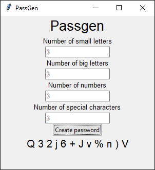

# 🔐 PassGen – The Tiny Password Generator with a GUI

Welcome to **PassGen**, a minimalist yet powerful password generator built with Python and Tkinter. Whether you're a privacy freak, a dev needing test passwords, or just someone who forgets their "P@ssw0rds", this tool’s got your back.

---

### ✨ Features

- 💬 Simple and clean graphical user interface
- 🔡 Choose how many lowercase and UPPERCASE letters you want
- 🔢 Add any number of digits
- 🔣 Spice it up with special characters
- 🔀 Randomly shuffled for max randomness
- 🎯 Lightweight and fast

---

### 🚀 How to Run

1. Make sure you have **Python 3.x** installed.
2. Download or clone this repo:
   ```bash
   git clone https://github.com/yourusername/passgen.git
   cd passgen
3. Run it:
    ```bash
    python passgen.py

🖼️ Screenshot
Here’s what PassGen looks like in action:


📝 Save your screenshot as screenshot.png in the project root directory and it'll show up right here on GitHub.

🧠 How It Works
You simply input how many characters you want in each category:

Lowercase letters (a-z)

Uppercase letters (A-Z)

Numbers (0-9)

Special characters (!#$%&()*+-.)

Click "Create password" and voilà — a randomized password appears below.

💡 Future Ideas
✅ Copy-to-clipboard button

⏳ Password expiration timer

🎲 One-click random strength presets

🧪 Strength meter (Weak / Medium / Strong)

👨‍💻 Created By
This little project was crafted with 💙 by Harun Riđević.

Feel free to use it, share it, or build on top of it!

📄 License
This project is licensed under the MIT License.
